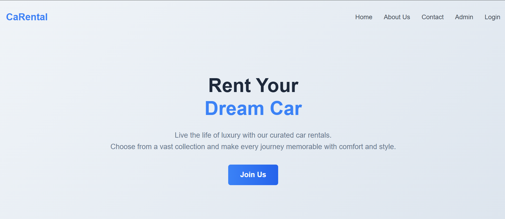
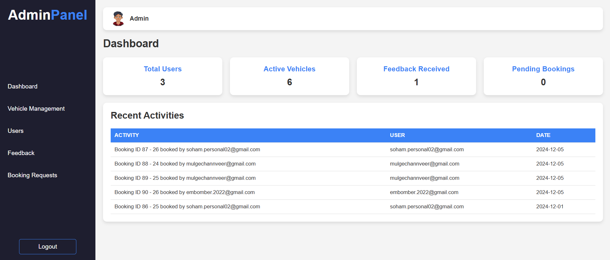

# Car Rental System

This is a web-based car rental system that allows users to rent cars online. The system includes features for user registration, login, car booking, and admin management.

## Screenshots

### Home Page


### Login Page


### Admin Dashboard


## Endpoints

### User Endpoints

- **Register**: `POST /register.php`
  - Request Body:
    ```json
    {
      "email": "user@example.com",
      "password": "password123",
      "confirm_password": "password123"
    }
    ```
  - Response:
    ```json
    {
      "message": "User registered successfully!"
    }
    ```

- **Login**: `POST /login.php`
  - Request Body:
    ```json
    {
      "email": "user@example.com",
      "password": "password123"
    }
    ```
  - Response:
    ```json
    {
      "message": "Login successful!",
      "redirect": "cardetails.php"
    }
    ```

### Admin Endpoints

- **Admin Register**: `POST /admin_register.php`
  - Request Body:
    ```json
    {
      "admin_id": "admin123",
      "admin_name": "Admin Name",
      "admin_email": "admin@example.com",
      "admin_password": "adminpass",
      "confirm_password": "adminpass"
    }
    ```
  - Response:
    ```json
    {
      "message": "Admin registered successfully!"
    }
    ```

- **Admin Login**: `POST /adminlogin.php`
  - Request Body:
    ```json
    {
      "admin_id": "admin123",
      "admin_password": "adminpass"
    }
    ```
  - Response:
    ```json
    {
      "message": "Welcome ADMINISTRATOR!",
      "redirect": "admindash.php"
    }
    ```

## Database Details

- **Database Name**: `carproject`
- **Tables**:
  - `admin`: Stores admin details.
  - `booking`: Stores booking details.
  - `cars`: Stores car details.
  - `feedback`: Stores user feedback.
  - `payment`: Stores payment details.
  - `users`: Stores user details.

### Table Structures

- **admin**:
  ```sql
  CREATE TABLE `admin` (
    `ADMIN_ID` varchar(255) NOT NULL,
    `ADMIN_NAME` varchar(255) NOT NULL,
    `ADMIN_EMAIL` varchar(255) NOT NULL,
    `ADMIN_PASSWORD` varchar(255) NOT NULL,
    PRIMARY KEY (`ADMIN_ID`),
    UNIQUE KEY `ADMIN_EMAIL` (`ADMIN_EMAIL`)
  );
  ```

- **booking**:
  ```sql
  CREATE TABLE `booking` (
    `BOOK_ID` int(11) NOT NULL AUTO_INCREMENT,
    `CAR_ID` int(11) NOT NULL,
    `EMAIL` varchar(255) NOT NULL,
    `BOOK_PLACE` varchar(255) NOT NULL,
    `BOOK_DATE` date NOT NULL,
    `DURATION` int(11) NOT NULL,
    `PHONE_NUMBER` bigint(20) NOT NULL,
    `DESTINATION` varchar(255) NOT NULL,
    `RETURN_DATE` date NOT NULL,
    `PRICE` int(11) NOT NULL,
    `BOOK_STATUS` varchar(255) NOT NULL DEFAULT 'UNDER PROCESSING',
    PRIMARY KEY (`BOOK_ID`),
    KEY `CAR_ID` (`CAR_ID`),
    KEY `EMAIL` (`EMAIL`),
    CONSTRAINT `booking_ibfk_1` FOREIGN KEY (`CAR_ID`) REFERENCES `cars` (`CAR_ID`) ON DELETE CASCADE ON UPDATE CASCADE,
    CONSTRAINT `booking_ibfk_2` FOREIGN KEY (`EMAIL`) REFERENCES `users` (`EMAIL`) ON DELETE CASCADE ON UPDATE CASCADE
  );
  ```

- **cars**:
  ```sql
  CREATE TABLE `cars` (
    `CAR_ID` int(11) NOT NULL AUTO_INCREMENT,
    `CAR_NAME` varchar(255) NOT NULL,
    `FUEL_TYPE` varchar(255) NOT NULL,
    `CAPACITY` int(11) NOT NULL,
    `PRICE` int(11) NOT NULL,
    `CAR_IMG` varchar(255) NOT NULL,
    `AVAILABLE` varchar(255) NOT NULL,
    PRIMARY KEY (`CAR_ID`)
  );
  ```

- **feedback**:
  ```sql
  CREATE TABLE `feedback` (
    `FED_ID` int(11) NOT NULL AUTO_INCREMENT,
    `EMAIL` varchar(255) NOT NULL,
    `COMMENT` text NOT NULL,
    PRIMARY KEY (`FED_ID`),
    KEY `TEST` (`EMAIL`),
    CONSTRAINT `TEST` FOREIGN KEY (`EMAIL`) REFERENCES `users` (`EMAIL`) ON DELETE CASCADE ON UPDATE CASCADE
  );
  ```

- **payment**:
  ```sql
  CREATE TABLE `payment` (
    `PAY_ID` int(11) NOT NULL AUTO_INCREMENT,
    `BOOK_ID` int(11) NOT NULL,
    `CARD_NO` varchar(255) NOT NULL,
    `EXP_DATE` varchar(255) NOT NULL,
    `CVV` int(11) NOT NULL,
    `PRICE` int(11) NOT NULL,
    PRIMARY KEY (`PAY_ID`),
    UNIQUE KEY `BOOK_ID` (`BOOK_ID`),
    CONSTRAINT `payment_ibfk_1` FOREIGN KEY (`BOOK_ID`) REFERENCES `booking` (`BOOK_ID`) ON DELETE CASCADE ON UPDATE CASCADE
  );
  ```

- **users**:
  ```sql
  CREATE TABLE `users` (
    `FNAME` varchar(255) NOT NULL,
    `LNAME` varchar(255) NOT NULL,
    `EMAIL` varchar(255) NOT NULL,
    `LIC_NUM` varchar(255) NOT NULL,
    `PHONE_NUMBER` bigint(11) NOT NULL,
    `PASSWORD` varchar(255) NOT NULL,
    `GENDER` varchar(255) NOT NULL,
    PRIMARY KEY (`EMAIL`)
  );
  ```

## Setup

1. Clone the repository:
   ```bash
   git clone https://github.com/c-mulge/carental.git
   ```

2. Navigate to the project directory:
   ```bash
   cd car-rental-system
   ```

3. Set up the database and update the `connection.php` file with your database credentials.

4. Start the server using XAMPP or any other local server environment.

5. Open the application in your browser:
   ```
   http://localhost/pro/my_pro/index.php
   ```

## License

This project is licensed under the MIT License.